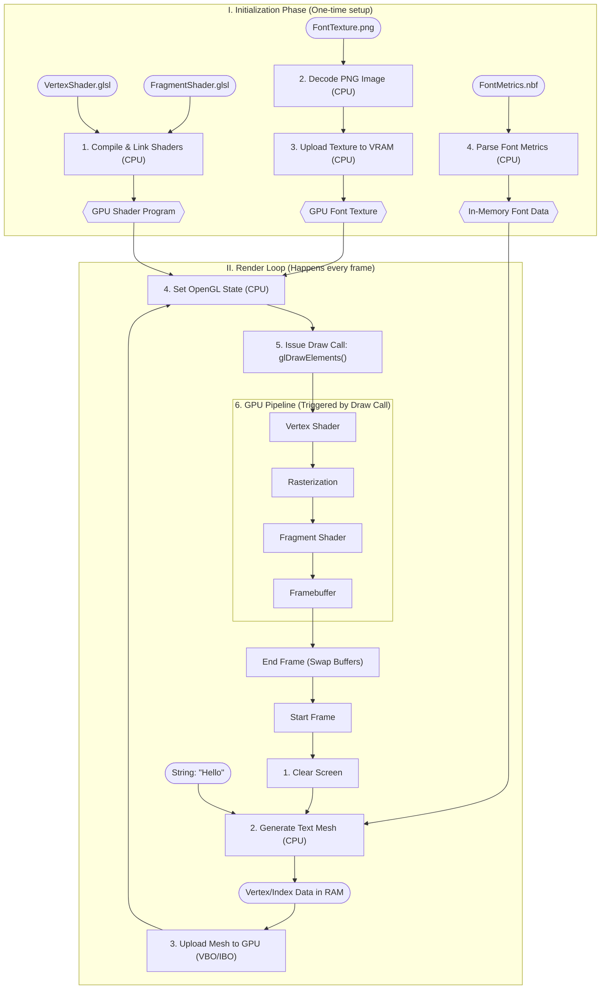

# SDF Text Rendering Application Structure

Here is a detailed illustration of the application structure and data flow for rendering text using Signed Distance Fields (SDF).

```mermaid
graph TD
    subgraph "I. Initialization Phase (One-time setup)"
        direction TB
        
        %% Shader Loading
        vs_file([VertexShader.glsl]) --> compile_shaders["1. Compile & Link Shaders (CPU)"]
        fs_file([FragmentShader.glsl]) --> compile_shaders
        compile_shaders --> gpu_program{{GPU Shader Program}}

        %% Texture Loading
        png_file([FontTexture.png]) --> decode_png["2. Decode PNG Image (CPU)"]
        decode_png --> upload_tex["3. Upload Texture to VRAM (CPU)"]
        upload_tex --> gpu_texture{{GPU Font Texture}}

        %% Font Metrics Loading
        nbf_file([FontMetrics.nbf]) --> parse_metrics["4. Parse Font Metrics (CPU)"]
        parse_metrics --> font_data{{In-Memory Font Data}}
    end

    subgraph "II. Render Loop (Happens every frame)"
        direction TB

        start_frame["Start Frame"] --> clear_screen["1. Clear Screen"]

        %% Mesh Generation
        clear_screen --> generate_mesh_cpu["2. Generate Text Mesh (CPU)"]
        font_data --> generate_mesh_cpu
        text_string(["String: &quot;Hello&quot;"]) --> generate_mesh_cpu
        generate_mesh_cpu --> ram_buffers([Vertex/Index Data in RAM])
        ram_buffers --> upload_mesh["3. Upload Mesh to GPU (VBO/IBO)"]
        
        %% CPU Draw Commands
        upload_mesh --> set_gl_state["4. Set OpenGL State (CPU)"]
        gpu_program --> set_gl_state
        gpu_texture --> set_gl_state
        set_gl_state --> issue_draw["5. Issue Draw Call: glDrawElements()"]

        %% GPU Pipeline
        subgraph "6. GPU Pipeline (Triggered by Draw Call)"
            direction TB
            vs[Vertex Shader] --> rast[Rasterization]
            rast --> fs[Fragment Shader]
            fs --> framebuffer[Framebuffer]
        end

        issue_draw --> vs
        framebuffer --> end_frame["End Frame (Swap Buffers)"]
        end_frame --> start_frame
    end
```
