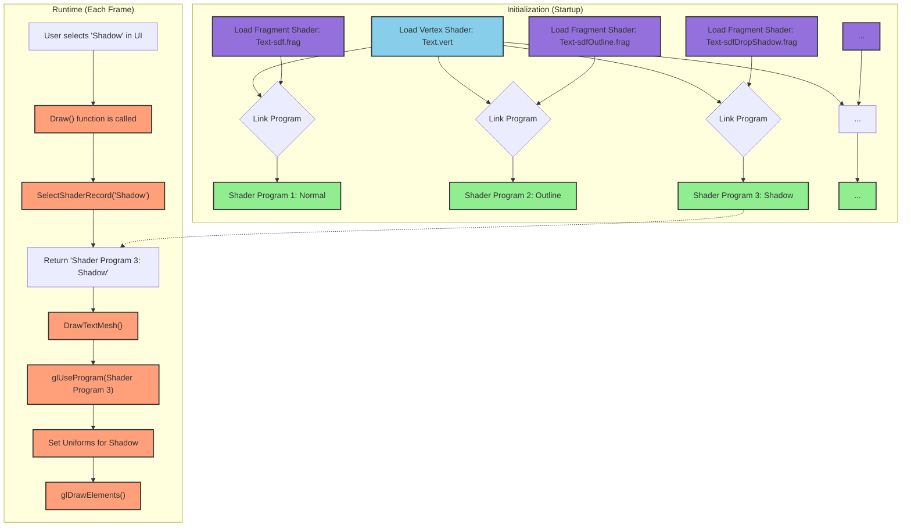

## How SdfFonts.cpp Uses One Vertex Shader and Multiple Fragment Shaders at Runtime

The `SdfFonts.cpp` application demonstrates a common and efficient pattern in graphics programming: using a single vertex shader with multiple fragment shaders to achieve various visual effects.

Here’s a step-by-step explanation of how this works at runtime:

### 1.  **Initialization Phase (in the `SdfFonts` constructor)**

*   **All Shaders are Compiled Upfront:** When the application starts, it doesn't just compile one shader; it compiles *all* the shaders it might need.
*   **Creating Shader Programs:** OpenGL doesn't use vertex and fragment shaders individually. It uses a **Shader Program**, which is a combination of a compiled vertex shader, a compiled fragment shader, and other optional shaders, all linked together.
*   **One Vertex, Many Fragments:** The `GenerateShaderRecord` function is called multiple times. Each time, it takes the *same* vertex shader (`Text.vert`) but a *different* fragment shader (e.g., `Text-sdf.frag`, `Text-sdfOutline.frag`, `Text-sdfDropShadow.frag`).
*   **Storing Programs:** Each of these linked shader programs is stored in the `m_resources` struct. For example, `m_resources.ShadersSdf.Normal` holds the program for standard SDF rendering, and `m_resources.ShadersSdf.Shadow` holds the program for rendering with a shadow.

At the end of the initialization, the application has a collection of ready-to-use shader programs, each tailored for a specific visual effect.

### 2.  **The Render Loop (the `Draw` function)**

This happens every frame:

*   **Check for User Input:** The `Draw` function first checks the UI settings, which are managed by the `m_shared` object. This tells the application which effect the user currently wants to see (e.g., "Outline", "Shadow").
*   **Select the Right Program:** This is the key step. The `Draw` function calls `SelectShaderRecord(fontSdfMode, fontDrawConfig.Type)`. This function is a simple `switch` statement that looks at the user's selection and returns the corresponding, pre-compiled shader program from the `m_resources` struct.
*   **Pass the Program to the Renderer:** The chosen shader program is then passed to the `DrawTextMesh` function.

### 3.  **Drawing the Text (the `DrawTextMesh` function)**

*   **Activate the Shader:** The very first thing `DrawTextMesh` does is call `glUseProgram(shader.Program.Get())`. This command tells the GPU: "For all the drawing I'm about to do, use this specific shader program."
*   **Set Uniforms:** It then sets the uniform variables (like the projection matrix, smoothing, and shadow offset) for that *specific* active program.
*   **Draw:** Finally, it calls `glDrawElements` to render the text mesh. The GPU's vertex processor runs the single vertex shader, and the fragment processor runs the specific fragment shader that was part of the activated program.

### **Summary of the Sequence**

1.  **Startup:** Compile the vertex shader once. Compile each fragment shader once. Link the vertex shader with each fragment shader to create multiple, complete shader programs.
2.  **Runtime (Each Frame):**
    a.  Check which effect the user has selected.
    b.  Choose the pre-compiled shader program for that effect.
    c.  Activate the chosen program with `glUseProgram()`.
    d.  Draw the text.

This method is very efficient because compiling and linking shaders can be slow. By doing all of that work at the beginning, the application can quickly switch between complex visual effects instantly at runtime with a single `glUseProgram` call.

### Visualization

Here is a flowchart that illustrates the process:

